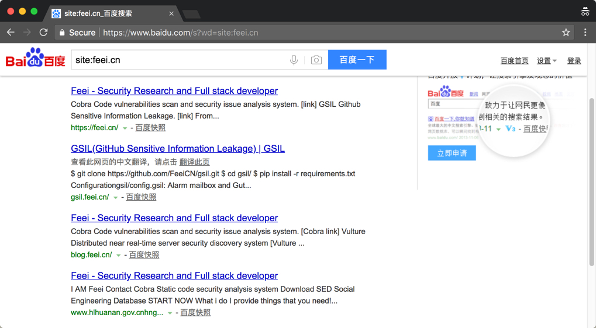
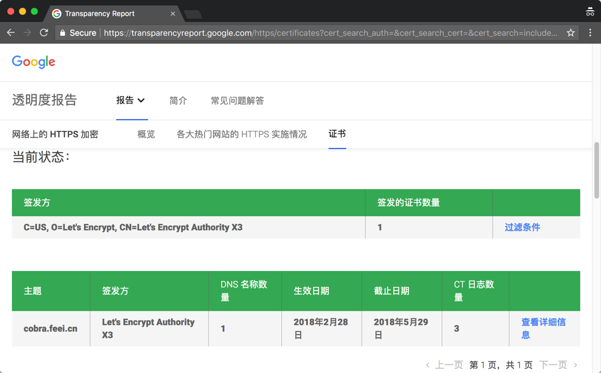
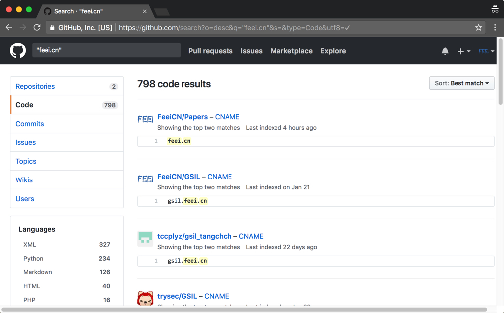

# 枚举子域名
Feei<feei#feei.cn> 02/2018

## 1. 事情背景
开始渗透一个网站前，需要知道网站的网络资产：域名、IP等，而IP和域名有着直接的解析关系，所以如何找到网站所有子域名是关键。

## 2. 实现思路
在知道网站主域名的情况下，可以通过以下几种方式进行域名收集。

### 2.1. 搜索引擎
使用百度、Google等搜索引擎，可通过`site`关键字查询所有收录该域名的记录，而子域名权重较高会排在前面。

以`feei.cn`为例，可以通过搜索`site:feei.cn`来获取`feei.cn`被收录的子域名。

- 百度: `https://www.baidu.com/s?wd=site:feei.cn`
- Google: `https://www.google.com.hk/search?q=site:feei.cn`
- Bing: `https://www.bing.com/search?q=site:feei.cn` 
- Yahoo: `https://search.yahoo.com/search?p=site:feei.cn`



缺点：接口性质的子域名不会被搜索引擎收录，存在遗漏

### 2.2. Google HTTPS证书透明度
Google透明度报告中的[证书透明度项目](https://transparencyreport.google.com/https/certificates)是用来解决HTTPS证书系统的结构性缺陷，它能够让所有人查询各个网站的HTTPS证书信息，从而能发现签发了证书的子域名。
[`feei.cn`的证书透明度结果](https://transparencyreport.google.com/https/certificates?cert_search_auth=&cert_search_cert=&cert_search=include_expired:true;include_subdomains:true;domain:feei.cn&lu=cert_search)



缺点：对于只签根域名证书的情况，存在遗漏

### 2.3. 自身泄露

- 流量代理：通过[WebProxy](https://github.com/FeeiCN/WebProxy)代理电脑所有流量，再分析流量中中出现的子域名
    - 域名跳转记录中的子域名
    - Response中存在的子域名
    - 网络请求资源中的子域名
- GitHub搜索：`https://github.com/search?o=desc&q=%22feei.cn%22&s=indexed&type=Code&utf8=✓`
- DNS域传递：`dig @8.8.8.8 axfr www.feei.cn`
- crossdomain.xml：`http://www.feei.cn/crossdomain.xml`
- DNSPod：`http://www.dnspod.cn/proxy_diagnose/recordscan/feei.cn?callback=feei`



缺点：不全面，存在遗漏

### 2.4. DNS查询
域名的存在是为了避免让大家记住IP而出现的，因此域名都是对应着IP的。所以可以通过收集常用域名字典，去DNS服务商查询是否有解析记录来枚举子域名。
比如`feei.cn`，通过`dig`命令可以看到二级域名`papers.feei.cn`的DNS解析记录（ANSWER SECTION）。
```shell
$ dig papers.feei.cn
; <<>> DiG 9.9.7-P3 <<>> papers.feei.cn
;; global options: +cmd
;; Got answer:
;; ->>HEADER<<- opcode: QUERY, status: NOERROR, id: 45877
;; flags: qr rd ra; QUERY: 1, ANSWER: 3, AUTHORITY: 0, ADDITIONAL: 1

;; OPT PSEUDOSECTION:
; EDNS: version: 0, flags:; udp: 512
;; QUESTION SECTION:
;papers.feei.cn.			IN	A

;; ANSWER SECTION:
papers.feei.cn.		599	IN	CNAME	feeicn.github.io.
feeicn.github.io.	3599	IN	CNAME	sni.github.map.fastly.net.
sni.github.map.fastly.net. 29	IN	A	151.101.77.147

;; Query time: 146 msec
;; SERVER: 8.8.8.8#53(8.8.8.8)
;; WHEN: Fri Mar 02 17:28:15 CST 2018
;; MSG SIZE  rcvd: 128
```

缺点：速度，存在少量漏报

## 3. 最佳实践
每种思路都存在漏报的可能，结合起来查询的结果才能最全面。着重说下第四种方式，通过DNS查询来枚举子域名。
通过DNS来枚举需要解决两个问题，字典和速度。

### 3.1. 字典

**DNS服务商：从子域名中来，到子域名中去**

DNS服务商的字典是最准确有效的，先找到一份DNSPod公布的使用最多的子域名：[dnspod-top2000-sub-domains.txt](https://github.com/DNSPod/oh-my-free-data/blob/master/src/dnspod-top2000-sub-domains.txt)

**通用字典**

一些基础的组合的字典，在大小和命中做取舍。

- 单字母：`f.feei.cn`（大都喜欢短一点的域名，单字符的最为常见）
- 单字母+单数字：`s1.feei.cn`
- 双字母：`sd.feei.cn`（大都喜欢业务的首字母缩写）
- 双字母+单数字：`ss1.feei.cn`
- 双字母+双数字：`ss01.feei.cn`
- 三字母：`www.feei.cn`（部分业务名称为三个字）
- 单数字：`1.feei.cn`
- 双数字：`11.feei.cn`
- 三数字：`666.feei.cn`

**常用词组**

一些最常见中英文的词组。

- `fanyi.feei.cn`（中）`tranlate.feei.cn`（英）
- `huiyuan.feei.cn`（中）`member.feei.cn`（英）
- `tupian.feei.cn`（中）`picture.feei.cn`（英）


**同类爆破工具的字典**

同类工具各自都收集整理了独有的字典，全部结合起来。

- [subbrute](https://github.com/TheRook/subbrute): [names_small.txt](https://github.com/TheRook/subbrute/blob/master/names_small.txt)
- [subDomainsBrute](https://github.com/lijiejie/subDomainsBrute): [subnames_full.txt](https://github.com/lijiejie/subDomainsBrute/blob/master/dict/subnames_full.txt)
- [dnsbrute](https://github.com/Q2h1Cg/dnsbrute): [53683.txt](https://github.com/Q2h1Cg/dnsbrute/blob/v2.0/dict/53683.txt)

### 3.2. 速度
使用常见的多进程、多线程及gevent等都无法发挥出最大的作用。
使用Python中的[asyncio](https://github.com/python/asyncio)+[aioDNS](https://github.com/saghul/aiodns)来获取最大速度。
一个简单的例子:
```python
import asyncio
import aiodns

loop = asyncio.get_event_loop()
resolver = aiodns.DNSResolver(loop=loop)
f = resolver.query('google.com','A')
result = loop.run_until_complete(f)
print(result)
```

**实现流程**

- 判断是否是泛解析域名
    - 查询一个绝对不存在域名的A记录，比如`enumsubdomain-feei.feei.cn`
    - 根据是否返回IP来判断是否是泛解析（若返回IP则是泛解析域名）
- 加载字典
    - 读取固定文本字典
    - 根据固定文本字典中的可变字典来动态生成新的字典
    - 合并去重
- 协程批量查询
    - 建立17万个任务
    - 每次最多同时跑10000个任务来避免任务加载时间过长
    - 记录每次查询结果
- 结果
    - 记录耗时
    - 写入结果文件

**字典生成**
```python
# https://github.com/FeeiCN/ESD/blob/master/ESD.py
def generate_general_dicts(self, line):
    letter_count = line.count('{letter}')
    number_count = line.count('{number}')
    letters = itertools.product(string.ascii_lowercase, repeat=letter_count)
    letters = [''.join(l) for l in letters]
    numbers = itertools.product(string.digits, repeat=number_count)
    numbers = [''.join(n) for n in numbers]
    for l in letters:
        iter_line = line.replace('{letter}' * letter_count, l)
        self.general_dicts.append(iter_line)
    number_dicts = []
    for gd in self.general_dicts:
        for n in numbers:
            iter_line = gd.replace('{number}' * number_count, n)
            number_dicts.append(iter_line)
    if len(number_dicts) > 0:
        return number_dicts
    else:
        return self.general_dicts
```

**同时最多10000个协程并行运行**
```python
# https://github.com/FeeiCN/ESD/blob/master/ESD.py
@staticmethod
def limited_concurrency_coroutines(coros, limit):
    from itertools import islice
    futures = [
        asyncio.ensure_future(c)
        for c in islice(coros, 0, limit)
    ]

    async def first_to_finish():
        while True:
            await asyncio.sleep(0)
            for f in futures:
                if f.done():
                    futures.remove(f)
                    try:
                        nf = next(coros)
                        futures.append(
                            asyncio.ensure_future(nf))
                    except StopIteration:
                        pass
                    return f.result()

    while len(futures) > 0:
        yield first_to_finish()

async def start(self, tasks):
    for res in self.limited_concurrency_coroutines(tasks, 10000):
        await res
```
通过扫描`qq.com`，共`170083`条规则，找到`1913`个域名，耗时`100-160`秒左右，平均`1000-1500`条/秒，后续再引入多进程可跑满带宽。

## 4. 存在问题

**域名泛解析问题**

通过DNS查询枚举子域名遇到的最大问题是域名泛解析问题，域名泛解析是厂商为方便维护解析记录，将域名所有情况都解析到同样服务器上。

比如在域名服务商配置`*.feei.cn`的`A记录`到`103.21.141.30`，则不管是访问`papers.feei.cn`/`f.feei.cn`/`cobra.feei.cn`都将会解析到`103.21.141.30`，再由这台服务器上的NGINX来区分域名及对应的后端应用。

所以当拿着字典爆破泛解析域名的子域名时，不论域名是否真实存在，都将会存在解析结果。

目前最好的解决方式是通过先获取一个绝对不存在域名的响应内容，再遍历获取每个字典对应的子域名的响应内容，通过和不存在域名的内容做相似度比对，来枚举子域名，但这样的实现是以牺牲速度为代价，后续计划做成可选项。

## 5. 对抗思路
> 虽然子域名本身就是公开的网络资产，但作为甲方安全得思考如何针对性的增大其收集子域名的难度。

**使用泛解析**

爆破泛解析是枚举子域名的难点，而泛解析的出现就是为了方便业务快速管理子域名，既然这样那企业采用泛解析的方式利大于弊。比如在新上线子域名时不用等待域名同步时间、对于一些不存在的域名能够handle 404页面、内部对于子域名统计更加方便。

**人机识别**

使用泛解析的方式仅仅是增大了时间成本，若面对的是定向攻击，攻击人员不在乎时间成本或是通过分布式的方式，则甲方需要解决人机识别，针对机器程序的页面相似度混淆。

## 6. 写在最后
作为渗透测试中最基础前置的点，枚举子域名需要做的事情太多，也只有各个点都覆盖到才能获取一份最接近真实全量的子域名。
项目命名为[ESD](https://github.com/FeeiCN/ESD)，最终实现已开源至[GitHub](https://github.com/FeeiCN/ESD)，欢迎参与一同维护。
